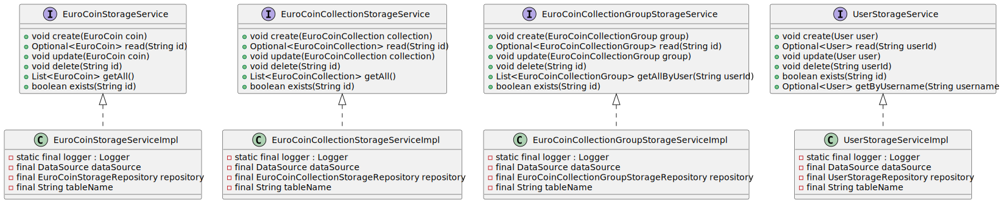

# Storage Service Layer – Current State

## 1. Purpose
The storage service layer acts as the transactional orchestration layer between the application/business logic and the repository layer. It manages database connections, controls transaction boundaries (commit/rollback), and provides a simplified API for persistence operations without exposing SQL or JDBC details.

## 2. Responsibilities Split
| Layer | Responsibility |
|-------|----------------|
| Service Layer | Opens/controls `Connection` from `DataSource`, sets transactional scope (`autoCommit(false)`), orchestrates repository calls, decides commit/rollback, translates repository results into service-level responses. |
| Repository Layer | Executes SQL operations using provided `Connection`, validates inputs, maps `ResultSet` to domain objects, returns results. |

Design constraints:
* Service methods manage the full lifecycle of a `Connection` (acquire, use, commit/rollback, close).
* Services are stateless and thread-safe.
* All transactional logic resides in the service layer.

## 3. Diagram

## 4. Service Interfaces (Canonical Shape)
All public methods abstract away `Connection` management. Methods do not throw checked `SQLException`; instead they handle exceptions internally and return appropriate results.

Implemented interfaces:
* `EuroCoinStorageService`
* `EuroCoinCollectionStorageService`
* `EuroCoinCollectionGroupStorageService`
* `UserStorageService`

## 5. Implementations
Concrete classes (suffix `StorageServiceImpl`) manage connections and transactions. Consistent internal elements:

| Aspect | Notes |
|--------|-------|
| DataSource | Injected dependency providing database connections. |
| Repository | Corresponding repository interface instance for data access. |
| Table name | Passed to repository/used for configuration. |
| Logger | One static logger per class for structured logging. |
| Connection Management | Uses try-with-resources for automatic connection cleanup. |
| Transaction Control | Sets `autoCommit(false)`, commits on success, rolls back on failure. |
| Error Handling | Catches all exceptions, logs appropriately, ensures cleanup, may rethrow as runtime exception. |

## 6. Summary
The storage service layer provides transactional CRUD operations for domain objects. It manages database connections, controls transaction boundaries, orchestrates repository calls, and provides a clean API that hides SQL/JDBC complexity from higher application layers. Services are stateless, thread-safe, and ensure proper resource cleanup and error handling.
