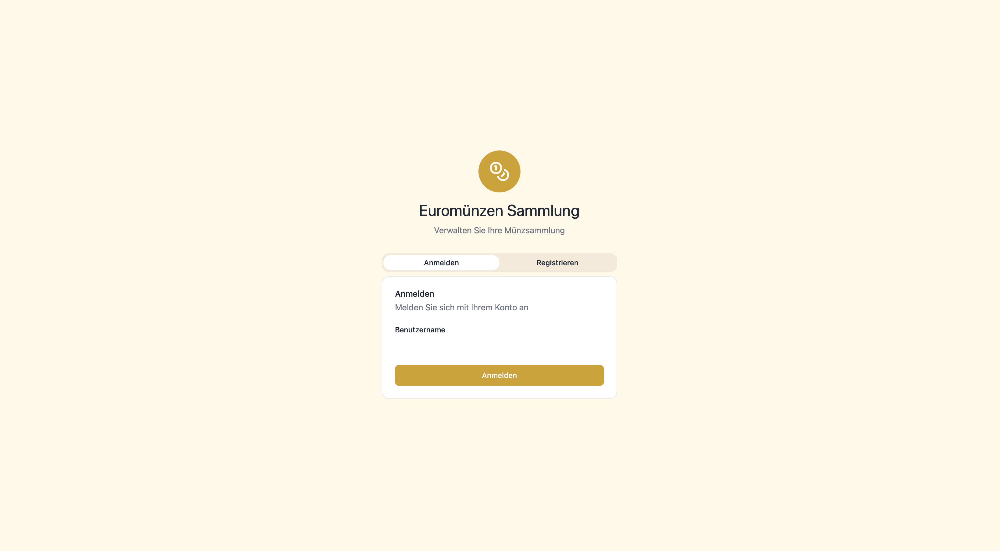
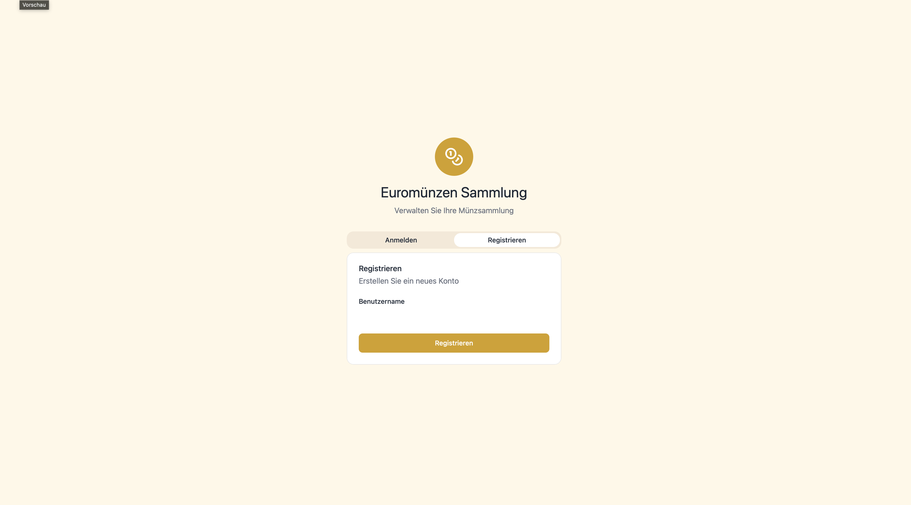
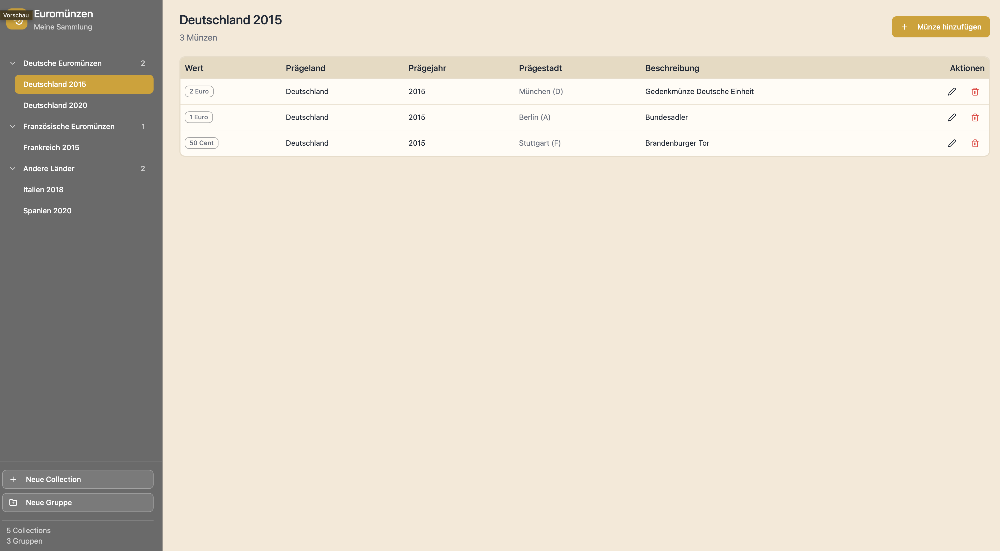
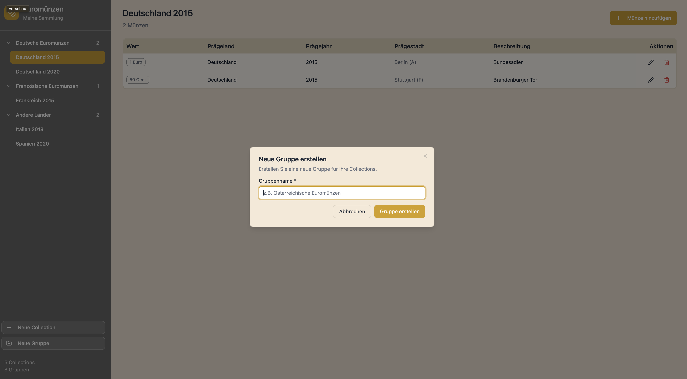
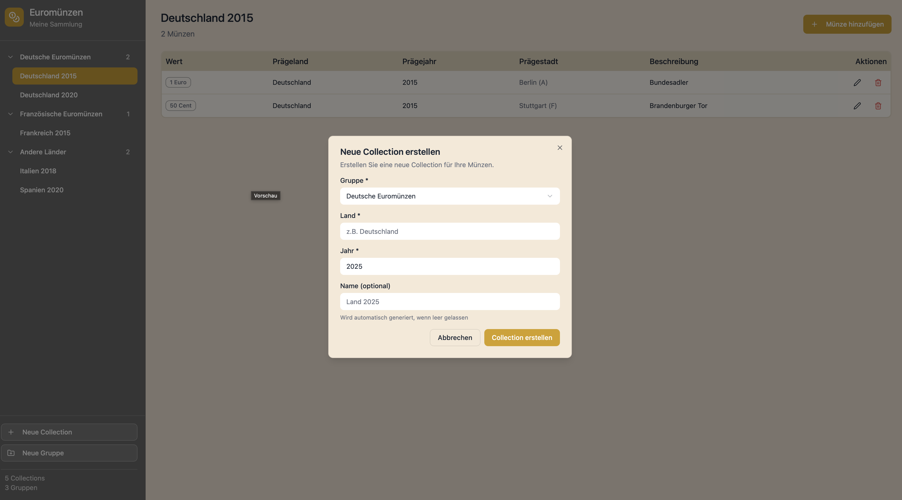
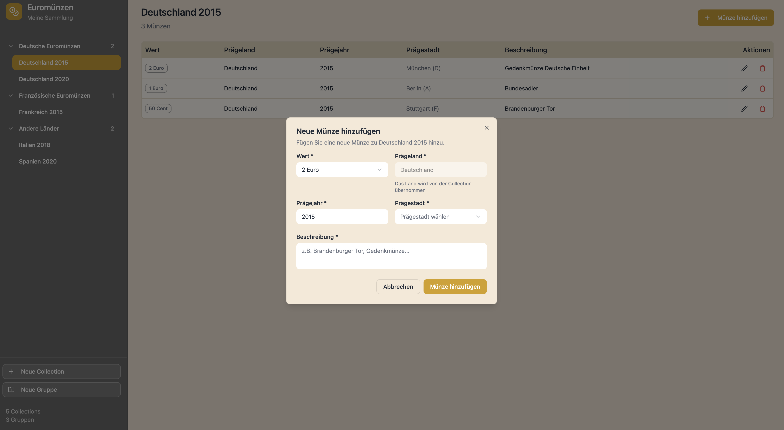
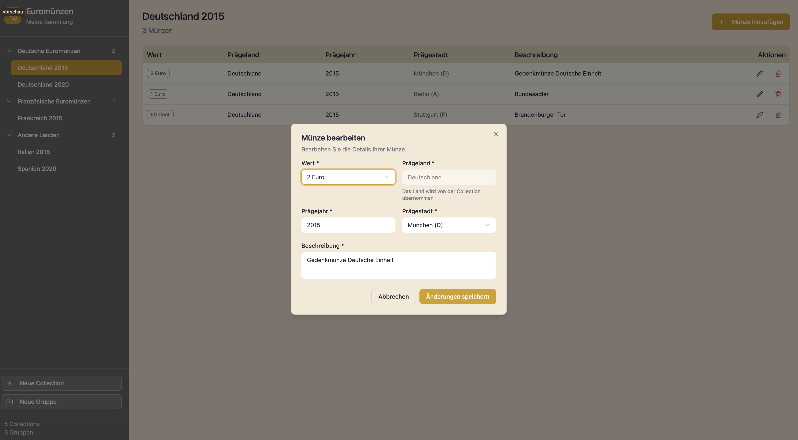

# Frontend Design v1 - CoinCollector.

[Demo](https://www.figma.com/make/8UXtHaDoD0cbsFvjOGrTls/Single-Site-Frontend-Design?t=OqdG1IbcLPLKErkC&fullscreen=1)

## Design Screens

### Authentication

#### Login Screen

#### Sign Up Screen

### Main Views

#### Main Screen with Groups
Overview displaying collection groups

#### Main Screen with Collections
Detailed view of individual collections within groups

### Collection Management

#### Add Group
Interface for creating new collection groups

#### Add Collection
Form for adding new coin collections to groups

### Coin Management

#### Add Euro Coin
Detailed form for adding individual euro coins with specifications

#### Edit Euro Coin
Interface for modifying existing coin entries

## Color Palette

The design uses a warm, coin-inspired color scheme with gold and silver accents complemented by neutral tones.

### Primary Colors
- **Gold Primary**: `#D4A017` (Main accent color for active selections, icons, and buttons)
- **Silver Secondary**: `#A3A3A3` (Secondary accent for badge borders)

### Background Colors
- **Sidebar Background**: `#6A6A6A` (Light gray for sidebar)
- **Main Area/Login Background**: `#FFF8E7` (Warm cream for main content areas)
- **Table Background**: `#FFFCF5` (Very light cream for table content)
- **Table Header**: `#E8D9C0` (Warm beige for table headers)

### Interactive Elements (Sidebar)
- **Hover State**: `#7A7A7A` (Medium gray for hover effects)
- **Button Background**: `#7A7A7A` (Default button background)
- **Button Hover**: `#8A8A8A` (Lighter gray for button hover state)
- **Active Selection**: `#D4A017` (Gold for active/selected items)

### Borders & Dividers
- **Table Border**: `#E8DCC8` (Light beige for table borders)
- **Border Transparency**: `rgba(255, 255, 255, 0.2)` (Semi-transparent white for sidebar borders)

### Text Colors
- **Badge Text Gray**: `#6B7280` (Medium gray for secondary text and badges)
